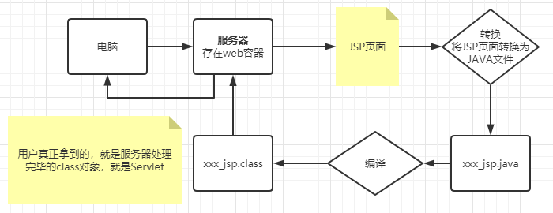

# JavaWeb

## 01.Tomcat 详解

## 02.Http讲解

## 03.Maven环境

## 04.IDEA中Maven的操作

## 05.Servlet

### 5.1 Servlet简介

- Servle就是sun公司开发动态web的一门技术

- Sun在这些API中提供一个借口叫做：Servlet，如果你想开发一个Servlet程序，只需要完成两个步骤：
  - 编写一个类，实现Servlet接口
  - 把开发好的Java类部署到web服务器中

**实现了Servlet接口的Java程序叫做，Servlet**

### 5.2 HelloServlet

#### 5.2.1编写Servlet的映射

为什么需要映射，因为我们写的是Java程序，但是要通过浏览器访问，而浏览器需要连接web服务器，**所以我们需要在web服务中注册我们写的Servlet，还需要给他一个浏览器能够访问的路径**

```java
//继承HttpServlet
public class ErrorServlet extends HttpServlet {
    @Override
    protected void doGet(HttpServletRequest req,HttpServletResponse resp) throws ServletException,IOException{
        //重写方法
    }
}
```


```xml
<!--注册Servlet-->
<servlet>
	<servlet-name>ErrorServlet</servlet-name>
    <servlet-class>com.ywz.servlet.ErrorServlet</servlet-class>
</servlet>
<!--Servlet请求路径-->
<servlet-mapping>
	<servlet-name>ErrorServlet</servlet-name>
    <url-pattern>/error</url-pattern>
</servlet-mapping>
```

#### 5.2.2配置Tomcat

### 5.3 Servlet运行原理

 

### 5.4 Mapping

1.一个Servlet可以指定一个映射路径

```xml
<servlet-mapping>
	<servlet-name>hello</servlet-name>
    <url-pattern>/hello</url-pattern>
</servlet-mapping>
```

2.一个Servlet可以指定多个映射路径

```mxl
<servlet-mapping>
	<servlet-name>hello</servlet-name>
    <url-pattern>/hello1</url-pattern>
</servlet-mapping>
<servlet-mapping>
	<servlet-name>hello</servlet-name>
    <url-pattern>/hello2</url-pattern>
</servlet-mapping>
```

3.一个Servlet可以指定通用映射路径

```xml
<servlet-mapping>
	<servlet-name>hello</servlet-name>
    <url-pattern>/hello/*</url-pattern>
</servlet-mapping>
```

4.指定一些后缀或者前缀等等

```xml
<servlet-mapping>
	<servlet-name>hello</servlet-name>
    <url-pattern>*.ywz</url-pattern> <!--"*"前面不能加映射路径-->
</servlet-mapping>
```

5.优先级问题

**指定了固有的映射路径优先级最高**，如果找不到则选择默认的处理请求

### 5.5 ServletContext（上下文）

web容器在启动的时候，它会为每个WEB程序都创建一个对应的ServletContext对象，它代表了当前的web应用；

```java
ServletContext servlerContext = this.getServletContext();
```

#### 5.5.1**共享数据**   

我在这个servlet中保存的数据，可以在另外一个servlet中拿到；

1.Servlet参数设置

2.Servlet参数取出

#### 5.5.2获取初始化参数

```xml
<!--配置一些web应用初始化参数-->
<context-param>
	<param-name>url</param-name>
    <param-vlaue>jsbc:mysql://localhost:3306/mybatis</param-vlaue>
</context-param>
```

#### 5.5.3请求转发

```java
//转发时浏览器路径不变
context.getRequesrDispatcher('/gp').forward(res,req);
```


#### 5.5.4 读取资源文件

```properties
username=ywz
password=123
```

```java
InputStream is = this.getServletContext().getResourceAsStream("/WEB-INF/classes/com/ywz/servlet/aa.properties");
Properties prop = new Properties();
prop.load(is);
String user = prop.getProperty("username");
String pwd = prop.getProperty("password");
resp.getWriter().print(user + ":" + pwd);
```

### 5.6 HttpRequest

HttpServletRequest代表客户端的请求，用户通过Http协议访问服务器，Http请求中的所有信息会被封装到HttpServletRequest，通过这个HttpServletRequest的方法，获得客户端的所有信息

### 5.7 HttpResponse

响应：web服务器接收到客户端的http请求，针对这个请求，分别创建一个代表请求的HttpServletRequest对象，代表响应的一个HttpServletResponse；

- 如果要获取客户端请求过来的参数：找HttpRequest
- 如果要给客户一些响应信息：找HttpResponse

#### 5.7.1 简单分类

负责向浏览器发送数据的方法

- ```java
  ServletOutputStream getOutputStream() throws IOException;
  PrintWriter getWriter() throws IOException;
  ```

#### 5.7.2 下载文件

```java
protected void doGet(HttpServletRequest req, HttpServletResponse resp) throws ServletException, IOException {
        //1.要获取下载文件的路径
        String realPath = this.getServletContext().getRealPath("/1.png");
        //2.下载的文件名是什么？
        String fileName = realPath.substring(realPath.lastIndexOf("\\") + 1);
        //3.设置想办法让浏览器能够支持下载我们需要的东西
        resp.setHeader("Content-Disposition","attachment;filename=" + fileName);
        //4.获取下载文件的输入流
        FileInputStream in = new FileInputStream(realPath);
        //5.创建缓冲区
        int len = 0;
        byte[] buffer = new byte[1024];
        //6.获取下载文件输出流（OutputStream）
        ServletOutputStream out = resp.getOutputStream();
        //7.将FileOutputStream流西融入到buffer缓冲区,使用OutputStream将缓冲区的数据输入到客户端
        while ((len = in.read(buffer)) > 0){
            out.write(buffer,0,len);
        }
        //8.关闭流
        out.close();
        in.close();
    }
```

#### 5.7.3 实现重定向

B一个web资源收到A客户端请求后，他会通知A客户端去访问另外一个web资源C，这个过程叫重定向


常见场景

- 用户登录

  ```java
  void sendRedirect(String var1) throws IOException;
  ```

  测试

  ```java
  @Override
  protected void doGet(HttpServletRequest req, HttpServletResponse resp)
      throws ServletException, IOException {
      /* 重定向原理
      	resp.setHeader("Location","/r/img");
      	resp.setStatus("302");
      */
      resp.sendRedirect("/r/img");//重定向
  }
  ```

  

## 06.Cookie、Session

### 6.1会话

**会话**：用户打开了一个浏览器，点击了很多超链接，访问多个web资源，关闭浏览器，这个过程可以称之为会话

**有状态会话**：记录游客状态的会话，称之为有状态会话

### 6.2 保存会话的两种技术

**cookie**

- 客户端技术（响应、请求）

**session**

- 服务器技术，利用这个技术，可以保存用户的会话信息

### 6.3 Cookie

1.从请求中拿到cookie的信息

2.服务器响应给客户端cookie

```java
Cookie[] cookie = req.getCookie();//获得Cookie
Cookie.getName();//获得cookie的key
Cookie.getValue();//获得cookie的value
new Cookie(key,value);//新建一个Cookie
cookie.setMaxAge(time);//设置cookie的有效期
resp.addCookie(cookie);//响应给客户端一个cookie
```

cookie一般会保存在本地的用户目录下appdata;

## 07.Session（重点）

什么是session：

- 服务器会给每一个用户（浏览器）创建一个Session对象；
- 一个session独占一个浏览器，只要浏览器没关闭，Session就存在；
- 用户登入之后，整个网站它都可以访问；

Cookie和Session的区别

| 区别 | Cookie                                               | Session                                                      |
| ---- | ---------------------------------------------------- | ------------------------------------------------------------ |
|      | 用户数据写给用户的浏览器，浏览器保存（可以保存多个） | 把用户信息写到用户独占Session中，服务器保存（保存重要信息，避免服务器浪费） |

```java
HttpSession session = req.getSession();//得到session
session.invalidate();//session失效
```

```xml
<!-- 会话自动过期-->
<session-config>
	<session-timeout>15</session-timeout>
</session-config>
```


## 08. JSP

### 8.1 什么是JSP

java Server Pages：Java服务器端页面，也和Servlet一样，用于动态Web技术！

最大的特点：

- 写JSP就像在写HTML
- 区别：1.HTML只给用户提供静态数据 2.JSP页面中可以嵌入JAVA代码，为用户提供动态数据

### 8.2 JSP原理

思路：JSP到底怎么执行！

- 代码层面没有问题

- 服务器内部工作

  Tomcat中有一个work目录；

  IDEA中使用Tomcat的会在IDEA的tomcat中生产一个work目录

  ```java
  /*C:\Users\ywz\AppData\Local\JetBrains\IntelliJIdea2020.1\tomcat (IDEA的tomcat工作空间)
  *发现了页面变成java程序
  *index_jsp.class
  *index_jsp.java
  *浏览器向服务器发送请求，不管访问什么资源，其实都是在访问servlet！
  *JSP最终也会被转换成一个java类
  *JSP本质上就是一个Servlet
  */
  //初始化
  public void _jspInit(){}
  //销毁
  public void _jspDestroy(){}
  //服务
  public void _jspService(HttpServletRequest req,HttpServletResponse resp){}
  
  ```

1.判断请求

2.内置一些对象

```java
final javax.servlet.jsp.PageContext pageContext;				//页面上下文
javax.servlet.http.HttpSession session = null;					//session
final javax.servlet.ServletContext application;					//applicationContext
final javax.servlet.ServletConfig config;						//config
javax.servlet.jsp.JspWriter out = null;							//out
final java.lang.Object page = this;								//page 当前页
javax.servlet.jsp.JspWriter _jspx_out = null;
javax.servlet.jsp.PageContext _jspx_page_context = null;
HttpServletRequest request                                      //请求
HttpServletResponse response     								//响应
```

3.输出页面前增加的代码

```java
response.setContentType("text/html; charset=UTF-8");                  //设置响应的页面类型
pageContext = _jspxFactory.getPageContext(this, request, response,
                                          null, true, 8192, true);
_jspx_page_context = pageContext;
application = pageContext.getServletContext();
config = pageContext.getServletConfig();
session = pageContext.getSession();
out = pageContext.getOut();
_jspx_out = out;
```

4.以上的这些对象我们可以在jsp中直接使用



在JSP页面中：

只要是JAVA代码就会原封不动的输出；

如果是HTML代码就会被转换为**out.write("<html>\r\n");**这样的格式输出到前端

### 8.3 JSP基本语法


### 8.4 JSP指令

### 8.5 9大内置对象

- PageContext  //保存的数据只在一个页面有效
- Request   //保存的数据只在一个请求有效,**用户用完就不用了例如 查看网页内容**
- Response
- Session  //保存的数据只在一个会话有效，打开浏览器到关闭浏览器，**用户用完还会用例如购物车**
- Application【ServletContext】 //保存的数据只在服务器有效，打开服务器到关闭服务器，**一个用户用完了其他用户还要用，聊天数据，网站统计人数**
- config【ServletConfig】
- out
- page
- excepetion

查找顺序是从底层到高层，page -> request -> session -> application

###  8.6  JSP标签，JSTL标签，EL表达式


