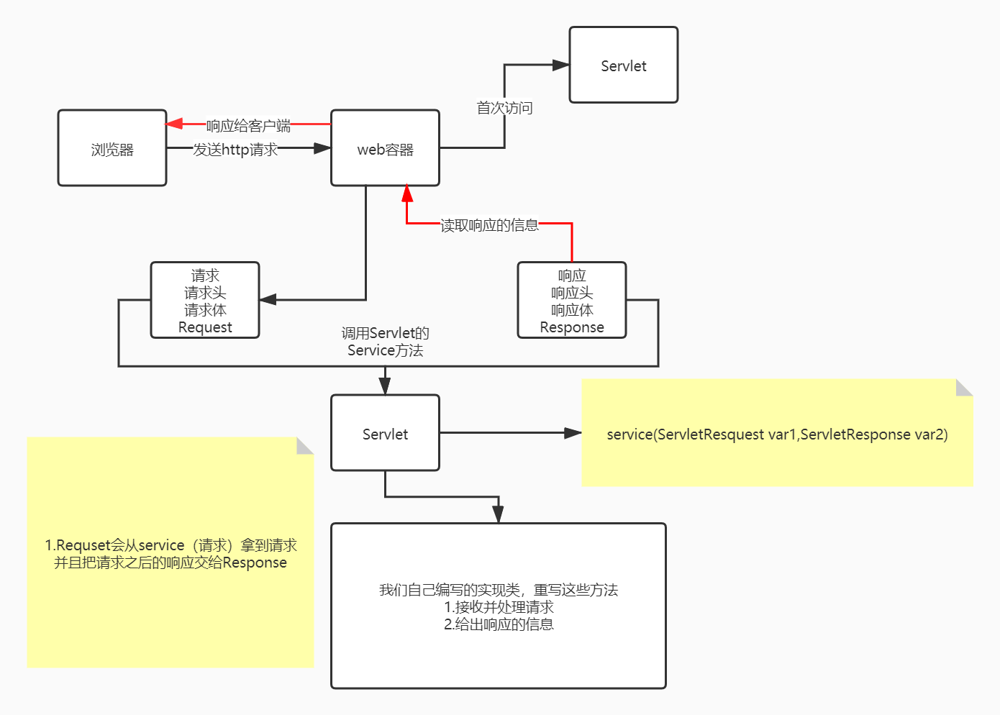
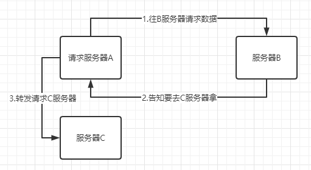

# JavaWeb

## 01.Tomcat 详解

## 02.Http讲解

## 03.Maven环境

## 04.IDEA中Maven的操作

## 05.Servlet

### 5.1 Servlet简介

- Servle就是sun公司开发动态web的一门技术

- Sun在这些API中提供一个借口叫做：Servlet，如果你想开发一个Servlet程序，只需要完成两个步骤：
  - 编写一个类，实现Servlet接口
  - 把开发好的Java类部署到web服务器中

**实现了Servlet接口的Java程序叫做，Servlet**

### 5.2 HelloServlet

#### 5.2.1编写Servlet的映射

为什么需要映射，因为我们写的是Java程序，但是要通过浏览器访问，而浏览器需要连接web服务器，**所以我们需要在web服务中注册我们写的Servlet，还需要给他一个浏览器能够访问的路径**

```java
//继承HttpServlet
public class ErrorServlet extends HttpServlet {
    @Override
    protected void doGet(HttpServletRequest req,HttpServletResponse resp) throws ServletException,IOException{
        //重写方法
    }
}
```


```xml
<!--注册Servlet-->
<servlet>
	<servlet-name>ErrorServlet</servlet-name>
    <servlet-class>com.ywz.servlet.ErrorServlet</servlet-class>
</servlet>
<!--Servlet请求路径-->
<servlet-mapping>
	<servlet-name>ErrorServlet</servlet-name>
    <url-pattern>/error</url-pattern>
</servlet-mapping>
```

#### 5.2.2配置Tomcat

### 5.3 Servlet运行原理

 

### 5.4 Mapping

1.一个Servlet可以指定一个映射路径

```xml
<servlet-mapping>
	<servlet-name>hello</servlet-name>
    <url-pattern>/hello</url-pattern>
</servlet-mapping>
```

2.一个Servlet可以指定多个映射路径

```mxl
<servlet-mapping>
	<servlet-name>hello</servlet-name>
    <url-pattern>/hello1</url-pattern>
</servlet-mapping>
<servlet-mapping>
	<servlet-name>hello</servlet-name>
    <url-pattern>/hello2</url-pattern>
</servlet-mapping>
```

3.一个Servlet可以指定通用映射路径

```xml
<servlet-mapping>
	<servlet-name>hello</servlet-name>
    <url-pattern>/hello/*</url-pattern>
</servlet-mapping>
```

4.指定一些后缀或者前缀等等

```xml
<servlet-mapping>
	<servlet-name>hello</servlet-name>
    <url-pattern>*.ywz</url-pattern> <!--"*"前面不能加映射路径-->
</servlet-mapping>
```

5.优先级问题

**指定了固有的映射路径优先级最高**，如果找不到则选择默认的处理请求

### 5.5 ServletContext（上下文）

web容器在启动的时候，它会为每个WEB程序都创建一个对应的ServletContext对象，它代表了当前的web应用；

```java
ServletContext servlerContext = this.getServletContext();
```

#### 5.5.1**共享数据**   

我在这个servlet中保存的数据，可以在另外一个servlet中拿到；

1.Servlet参数设置

2.Servlet参数取出

#### 5.5.2获取初始化参数

```xml
<!--配置一些web应用初始化参数-->
<context-param>
	<param-name>url</param-name>
    <param-vlaue>jsbc:mysql://localhost:3306/mybatis</param-vlaue>
</context-param>
```

#### 5.5.3请求转发

```java
//转发时浏览器路径不变
context.getRequesrDispatcher('/gp').forward(res,req);
```



#### 5.5.4 读取资源文件

```properties
username=ywz
password=123
```

```java
InputStream is = this.getServletContext().getResourceAsStream("/WEB-INF/classes/com/ywz/servlet/aa.properties");
Properties prop = new Properties();
prop.load(is);
String user = prop.getProperty("username");
String pwd = prop.getProperty("password");
resp.getWriter().print(user + ":" + pwd);
```

### 5.6 HttpRequest

HttpServletRequest代表客户端的请求，用户通过Http协议访问服务器，Http请求中的所有信息会被封装到HttpServletRequest，通过这个HttpServletRequest的方法，获得客户端的所有信息

### 5.7 HttpResponse

响应：web服务器接收到客户端的http请求，针对这个请求，分别创建一个代表请求的HttpServletRequest对象，代表响应的一个HttpServletResponse；

- 如果要获取客户端请求过来的参数：找HttpRequest
- 如果要给客户一些响应信息：找HttpResponse

#### 5.7.1 简单分类

负责向浏览器发送数据的方法

- ```java
  ServletOutputStream getOutputStream() throws IOException;
  PrintWriter getWriter() throws IOException;
  ```

#### 5.7.2 下载文件

```java
protected void doGet(HttpServletRequest req, HttpServletResponse resp) throws ServletException, IOException {
        //1.要获取下载文件的路径
        String realPath = this.getServletContext().getRealPath("/1.png");
        //2.下载的文件名是什么？
        String fileName = realPath.substring(realPath.lastIndexOf("\\") + 1);
        //3.设置想办法让浏览器能够支持下载我们需要的东西
        resp.setHeader("Content-Disposition","attachment;filename=" + fileName);
        //4.获取下载文件的输入流
        FileInputStream in = new FileInputStream(realPath);
        //5.创建缓冲区
        int len = 0;
        byte[] buffer = new byte[1024];
        //6.获取下载文件输出流（OutputStream）
        ServletOutputStream out = resp.getOutputStream();
        //7.将FileOutputStream流西融入到buffer缓冲区,使用OutputStream将缓冲区的数据输入到客户端
        while ((len = in.read(buffer)) > 0){
            out.write(buffer,0,len);
        }
        //8.关闭流
        out.close();
        in.close();
    }
```

#### 5.7.3 实现重定向

B一个web资源收到A客户端请求后，他会通知A客户端去访问另外一个web资源C，这个过程叫重定向


常见场景

- 用户登录

  ```java
  void sendRedirect(String var1) throws IOException;
  ```

  测试

  ```java
  @Override
  protected void doGet(HttpServletRequest req, HttpServletResponse resp)
      throws ServletException, IOException {
      /* 重定向原理
      	resp.setHeader("Location","/r/img");
      	resp.setStatus("302");
      */
      resp.sendRedirect("/r/img");//重定向
  }
  ```

  